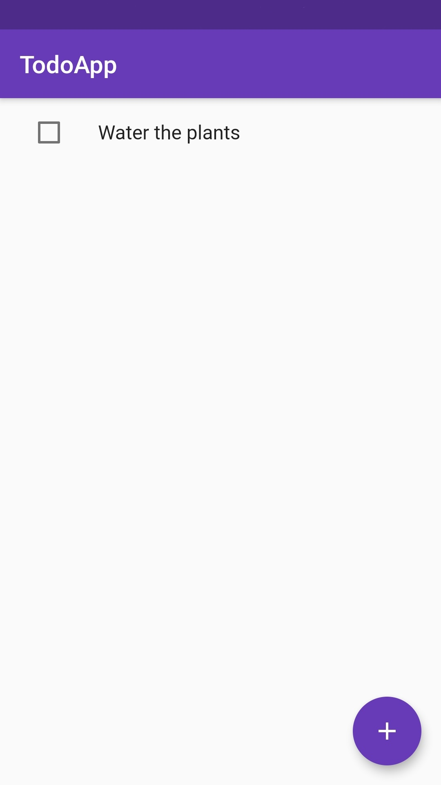

# TodoApp ✅ (Flutter)

<div style="display: flex; justify-content: space-between;">
  
  
</div>

## Libraries Used 🔨

- Redux (For state management)
- Redux Thunk (For async actions)
- Sqflite (For storing data)

## Building Release Version (Android) ⚙️

Create a keystore file in /android/app/ using `keytool` command

Create `key.properties` file in /android/ with these values

```
storeFile=...
storePassword=...
keyPassword=...
keyAlias=...
```

You can also use the default debug signing config for release if you want to.

---

You can use this app as a template if you need a local database and a global state app 😉

I have not tested it on iOS 🍎 but it should work 👍.
